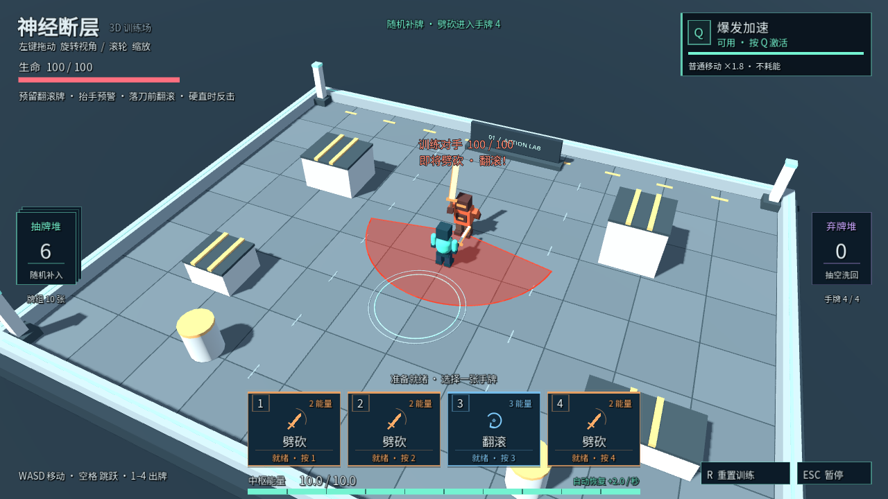
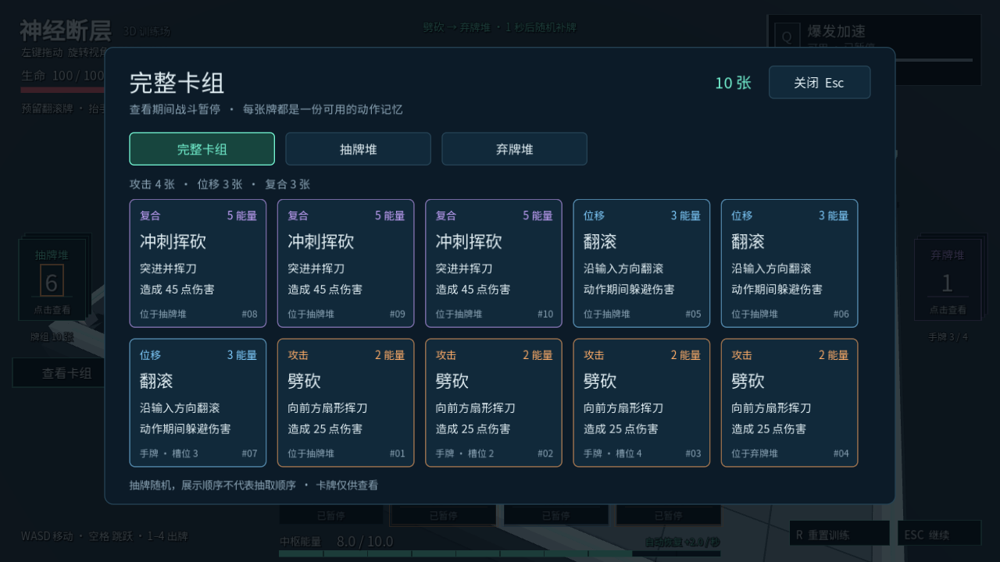

# 神经断层 · 3D 动作卡牌灰盒 Demo

**当前默认进入随机生成的第一层水岸街区。** 每次进入随机分配 20 栋建筑和 8 场街道遭遇：每个建筑地块为紧凑的 7×5 块地砖（14×10 米）长方形，道路净宽 4 格。居民楼从现有 GLB 款式中按地图种子随机选择，工厂取代原写字楼，商店使用新的建筑模型；新模型继续支持遮挡时的蓝青科技渐变虚化。建筑使用贴合模型表面的简化碰撞，不再由整块空气墙包围；玩家可以靠近凹入的墙面，踏上模型里容得下角色的台阶和平台。普通移动可上下不高于 0.30 米的小台阶，较高障碍仍需跳跃。E 交互、M 地图、N 重新生成、R 同图重试。浅水可站立，越过一格浅水带进入深水后会下沉迷失。详细规则见 [第一层地图说明](docs/first-floor.md)。原训练场保留在 `main.tscn`；下面保留其操作与动作规则说明。

一个可运行的 Godot 4.x **3D 灰盒训练场**，带可旋转与缩放的相机，使用 **13 种动作、初始 10 张／全解锁 18 张随机牌库、4 张可见手牌** 验证：**移动 → 选择动作牌 → 消耗能量 → 动作执行 → 弃牌与补牌 → 再出牌**。



按后续要求，场景已从最初的 2D 方案改为 3D 灰盒。玩法从《Godot最小动作卡牌Demo指南.md》的动作与能量闭环扩展为随机手牌、冲刺挥砍、初始义体和一个近战训练敌人；《神经断层-卡牌动作肉鸽执行指南.html》提供长期制作方向。两份原始指导文件均保留，未修改。

## 运行

需要 **Godot 4.3 或更新的 4.x 版本**，标准版即可，无需 .NET、插件或在线服务。项目使用 Compatibility 渲染器，逻辑视口为 **960 × 540**，默认以 **1280 × 720** 窗口显示，界面随窗口缩放。

### 使用 Godot 编辑器

1. 在 Godot 项目管理器中选择“导入”，打开本文件夹的 `project.godot`。
2. 进入编辑器后按 **F5** 运行项目。也可打开 `floor_one.tscn`，按 **F6** 运行第一层；`main.tscn` 可单独运行原训练场。

### macOS 一键运行

双击 **启动Demo.command**。脚本会在 `PATH` 中寻找 `godot` / `godot4`，再检查 `/Applications/Godot.app` 和 `~/Applications/Godot.app`。找不到兼容版本时会显示说明，不会下载或安装软件。

启动前会自动导入项目内的字体和图标等本地资源，因此首次运行不需要已有的 `.godot` 缓存。

如果系统尚未允许 Godot 运行，请先在 Finder 中正常打开一次 Godot.app，再运行脚本。也可以直接使用编辑器方式导入项目。

### 命令行

在项目目录执行：

```sh
godot --path .
```

若本机命令名为 `godot4`，将上述 `godot` 替换为 `godot4`。

## 查看和编辑角色动画

项目现在用 Godot 原生 `AnimationPlayer` 驱动主角骨骼。主角使用 `main Character/futuristic+armored+female+3d+model (8).glb`，资源内嵌了 `idle`、`run`、`punch`、`front_kick_02`、跳跃和前滚动画；移动时播放 `run`，停止后循环播放 `idle`。出拳卡和突进出拳卡映射到 `punch`，回旋踢卡使用模型内真实的 `front_kick_02`，跳跃与翻滚使用对应模型动作，扫腿在模型没有专用片段时使用运行时生成的扫腿片段。运行时会移除 Hips 根位移，避免动画位移和玩家碰撞移动叠加。`character_visual.gd` 的 `use_animation_player` 可临时关闭以回到旧的程序化姿势。

要拖动骨骼并查看时间轴，打开独立工作台目录 `character_animation_lab/`，在 Godot 中打开 `main.tscn`：

1. 展开 `CharacterPivot/CharacterRig/Character/Armature/Skeleton3D`，选择骨骼并在 3D 视图拖动 gizmo。
2. 选择 `CharacterPivot/CharacterRig/AnimationPlayer`，在底部 Animation 面板选择 `idle`、`walk`、`slash` 等现有动作，或新建动作。
3. 在时间轴定位后选中骨骼，点击钥匙图标插入旋转/位置/缩放关键帧；完成后用 Animation 面板的保存按钮写回 `character_animation_lab/animations/player_actions.tres`，也可用 **Save As…** 保存到 `exports/`。

工作台运行预览支持数字键：`1 idle`、`2 walk`、`3 slash`、`4 roll`、`5 dash_slash`、`6 punch`、`7 shot`、`8 charged_slash`、`9 jump`、`0 dead`，空格播放/暂停，F 重置镜头，S 显示保存提示。完整操作说明见 [character_animation_lab/README.md](character_animation_lab/README.md)。

## 操作

| 输入 | 效果 |
| --- | --- |
| W / A / S / D 或上下左右方向键 | 相机相对的八方向移动，最后的移动方向决定角色朝向 |
| 空格 | 起跳；落地后可以再次跳跃，不消耗能量或卡牌 |
| 1 / 2 / 3 / 4 | 打出对应位置的当前手牌；键位对应卡槽，不固定对应动作 |
| Q | 激活初始义体“爆发加速”；不消耗能量或手牌 |
| 点击手牌 | 与该卡槽数字键相同，执行卡片显示的动作 |
| 查看卡组按钮 / Tab | 打开完整卡组，查看每张牌的费用、作用与所在区域 |
| 点击左侧抽牌堆 / 右侧弃牌堆 | 查看对应牌堆中的所有卡牌 |
| 在场景中按住鼠标左键拖动 | 旋转观察相机，松开停止；点击卡牌仍然出牌 |
| 触控板双指张开 / 捏合 | 张开拉近相机，捏合拉远相机 |
| 鼠标滚轮 / 触控板双指上下滑动 | 拉近 / 拉远相机 |
| E | 靠近场景中的动作记忆终端，恢复对应动作并将新牌加入抽牌堆 |
| R | 重置双方、生命和能量，保留本次解锁并重建牌组，重新发四张手牌 |
| Esc | 暂停 / 继续 |

抽牌堆位于屏幕左侧，弃牌堆位于右侧；四张紧凑手牌集中在底部中央，能量条位于屏幕最底部。手牌区域的大底板已移除，空白处透明；卡片、牌堆与按钮本身保留不透明背景，便于阅读。界面空白区域可按住左键拖动镜头，点击卡槽或两侧牌堆不会开始旋转。

相机支持水平 360° 环绕，上下可从接近水平调整到接近垂直俯视，距离范围为 4～85 米。镜头始终围绕角色；旋转后 WASD 仍按视角移动。暂停、查看卡组或城市地图期间，镜头手势不会影响场景。

左侧牌堆下方的“查看卡组”按钮可打开完整卡组，面板内可切换“全部卡组 / 抽牌堆 / 弃牌堆 / 动作图鉴”。同名牌分别展示，完整卡组包括当前手牌、抽牌堆与弃牌堆，并标注每张牌当前的位置；空牌堆有提示。牌面可以查看动作类型、费用和效果，卡牌较多时可滚动查看。抽牌堆按动作种类整理展示，实际仍随机抽取，列表顺序不代表抽牌顺序。“动作图鉴”展示全部十三种动作及解锁状态；未解锁条目只是图鉴，不计入实体牌数量。

查看期间战斗、动作、能量恢复、义体冷却与补牌计时均暂停，面板内的牌仅供查看。点击关闭按钮，或按 Esc / Tab 关闭，恢复打开前的暂停状态；如果原本已手动暂停，关闭后仍保持暂停。面板内按 R 会关闭并重置训练。查看不会消耗卡牌、改变牌堆或触发洗牌。



翻滚和突进出拳期间世界方向锁定，转动相机或改变移动输入不会改变本次位移。翻滚中可立即插入一张快拳、出拳、扫腿或点射，攻击与翻滚同时进行，保留原有位移与避伤窗口；同一次翻滚最多插入一张攻击牌。出拳中可直接接翻滚，取消余波并立即避伤。蓄力重劈可以被位移牌取消；短距闪现后可以立即攻击，喷射跃升后可以接腾空斩或俯冲重斩。每张牌分别消耗能量并进入弃牌堆。

突进出拳保持突进锁定。同时按下多个卡槽时，只处理最左侧的卡槽；按住数字键不会连续出牌。能量不足、卡槽为空或当前不允许衔接时，不扣能量、不丢卡。攻击方向采用当前移动输入或最后移动朝向，翻滚中则沿翻滚方向攻击。

角色模型会沿最短角度逐步转向：默认每秒 360°，转 90° 约需 0.25 秒，掉头 180° 约需 0.5 秒。移动速度随模型与输入方向的夹角降低：对齐时全速，相差 90° 时约 55%，相差 180° 时约 10%；随着转正平滑恢复全速，避免背对移动方向时仍高速滑走。松开移动键立即停止位移，并转完最后的目标方向。步幅与步频也随实际水平速度变化。

`player.gd` 的 `turn_speed_degrees` 控制转身速度，`min_turn_speed_ratio` 控制掉头时最低速度比例（默认 0.10）。转向减速适用于普通地面/空中移动，并与 Q 的移速倍率叠加；翻滚和冲刺挥砍保留各自的固定速度，跳跃的垂直运动不受影响。出牌仍立即采用输入方向，暂停冻结转身，R 立即复位朝向。

按 Q 可激活初始义体 **“爆发加速”**。激活后持续 3 秒，普通移动速度变为 `5.5 × 1.8 = 9.9` 单位 / 秒；斜向移动仍会归一化。冷却从激活瞬间开始计时，共 8 秒，因此效果结束后还需约 5 秒才能再次使用。冷却期间不能叠加或刷新，按住 Q 不会自动重复触发。义体不改变劈砍、翻滚或冲刺挥砍的固定速度；翻滚中仍可同时劈砍。暂停时 Q 被拒绝且义体计时冻结，R 重置会清除持续时间和冷却。

按空格可以跳跃，长按不会自动连跳，也不能在空中再次起跳。角色在空中仍可用 WASD 调整方向、触发义体和打牌；已经开始的翻滚或冲刺挥砍会阻止起跳，空中使用这两张牌则保留重力和垂直速度。可以跳上低箱子，并站在箱顶再次起跳。暂停冻结空中运动，R 会回到出生点。

垂直运动独立计算 Y 轴速度，场地边界只限制 XZ；角色通过真实 3D 碰撞落地，不会被强制拉回固定地面高度。后续低空飞行技能可以调整 `player.gd` 的 `gravity_scale`（重力倍率）与 `vertical_acceleration`（向上加速度），例如抵消重力实现悬停，并在技能结束时恢复默认值。重置会恢复 `1.0` 倍重力、`0.0` 额外升力；本版暂未加入飞行技能。

## 动作记忆与场景解锁

认知受到扰乱，手牌代表当前能清晰想到的动作，所以同时只有四张。初始十张牌固定由 **3 张出拳、3 张生成护盾、2 张翻滚、1 张突进出拳、1 张回旋踢** 组成；每次从抽牌堆随机抽四张，其余六张留在抽牌堆。护盾牌费用 2，立即获得 10 点独立护盾，可叠加；护盾每 0.5 秒自然减少 1 点。

出生区附近放置了三处发光的“动作记忆”终端。靠近后会显示简短的 **E 恢复记忆** 提示：

| 终端 | 解锁动作 | 新增张数 |
| --- | --- | --- |
| 攻击记忆，出生点左侧 | 快拳、扫腿、点射、蓄力重劈 | 4 |
| 位移记忆，场地左后方 | 短距闪现、喷射跃升 | 2 |
| 复合记忆，出生点右侧 | 腾空斩、俯冲重斩 | 2 |

每种新动作解锁一张牌，**立即进入抽牌堆**，无需重置。已经恢复的终端变暗，不能重复领取；手牌上限仍为四张。全部恢复后共有 **13 种动作、18 张实体牌**。按 R 会保留本次会话的解锁并重建整副牌；关闭游戏再启动会回到初始五种，本版尚未加入存档。

| 类别 | 动作 | 费用 | 灰盒效果 |
| --- | --- | --- | --- |
| 攻击 | 快拳 | 1 | 短距离出拳，12 伤害 |
| 攻击 | 出拳 | 2 | 前方强力出拳，25 伤害 |
| 攻击 | 回旋踢 | 2 | 以自身为中心 2 米范围伤害，50 伤害；动作期间不能移动或出牌 |
| 攻击 | 扫腿 | 2 | 低身横扫前方，22 伤害 |
| 防御 | 生成护盾 | 2 | 获得 10 点独立护盾；每 0.5 秒失去 1 点 |
| 攻击 | 点射 | 2 | 朝面向直线射击，18 伤害，墙体会阻挡 |
| 攻击 | 蓄力重劈 | 3 | 蓄力约 0.20 秒后重击，45 伤害；可用位移牌取消 |
| 位移 | 翻滚 | 3 | 固定方向快速位移，0.44 秒动作时长、约 6.16 单位位移；可同时攻击 |
| 位移 | 短距闪现 | 3 | 向前闪现最多 3.5 米，胶囊碰撞防止穿墙；依靠位移躲避，无额外无敌 |
| 位移 | 喷射跃升 | 2 | 向上喷射并短暂前进，可衔接空中动作 |
| 复合 | 突进出拳 | 5 | 锁定方向突进，中段出拳，45 伤害 |
| 复合 | 腾空斩 | 4 | 向前起跳挥刀，20 伤害，可接俯冲重斩 |
| 复合 | 俯冲重斩 | 5 | 向前下坠，落地造成范围 60 伤害；地面出牌会先小跳 |

喷射跃升和腾空斩各在一次离地期间最多使用一次，落地后恢复，避免无限升空。俯冲重斩落地只结算一次伤害，障碍遮挡仍有效；空中使用翻滚或闪现可以取消俯冲。

成功出牌后，该牌进入弃牌堆，原卡槽空出；**1 秒后从剩余抽牌堆随机补一张**。抽出的实体牌会从抽牌堆移除，不会同时出现在两个位置。只有需要补牌且抽牌堆为空时，才把弃牌堆洗回抽牌堆，当前手牌保留。三个区域的牌总数始终等于当前已解锁牌组大小。暂停会冻结动作、能量恢复和补牌倒计时。

## 近战训练

前方的红橙色持刀敌人拥有 **100 生命**，头顶显示血量和攻击状态；玩家拥有 **100 生命**，显示在左上角。出生时敌人等待，走进约 3.5 米后开始交战。可以先在安全距离循环手牌，保留一张翻滚牌及至少 3 点能量后再靠近。

敌人靠近后抬手，约 **0.3 秒后**落刀；这段需要闪避时才显示地面扇形刀锋范围，并在抬手期间固定攻击方向。命中扣 **20 生命**。在近战距离触发攻击后，单靠普通走路后退或横移来不及走出攻击；看到抬手后准备，在落刀前打出翻滚牌，利用位移和 **0.22 秒翻滚避伤窗口**躲开。过早翻滚、结束后还留在刀锋范围内仍会受伤。敌人收招约 **1.2 秒**，此时可以用劈砍或冲刺挥砍反击。

双方攻击都有距离、角度、高度和障碍物遮挡判定，同一次挥刀对同一目标最多扣血一次。在有效翻滚期间避过刀锋后，这一刀的尾段不会再补中玩家；左右侧滚、向前穿过和向后退滚都能按时躲避。翻滚不造成伤害，冲刺挥砍没有翻滚的避伤效果。攻击高度也受限制，准确地在跳跃顶点越过攻击高度可以避刀，为后续空中技能保留空间。玩家受击会短暂闪红并显示扣血；敌人受击闪白，血量归零后倒下并停止攻击。玩家生命归零后停止操作，按 R 即可复活双方重新训练。Esc 会同时冻结双方动作和战斗计时。

敌人的参数集中在 `enemy.gd`，玩家伤害与生命参数在 `player.gd`；这些数值用于先验证“读抬手 → 翻滚 → 收招反击”的节奏，可继续调整。Q 爆发加速、跳跃和未来飞行仍保留各自的运动规则。

## 原型参数

角色参数集中在 `player.gd` 的导出变量中。下列距离和速度使用 3D 场景单位。

| 参数 | 默认值 |
| --- | --- |
| 普通移动速度 | 5.5 单位 / 秒 |
| 模型转身速度 | 360° / 秒，180° 掉头约 0.5 秒 |
| 转向移动比例 | 0°：100%；90°：55%；180°：10%，连续变化 |
| 跳跃初速度 | 8.0 单位 / 秒 |
| 重力 / 最大下落速度 | 24.0 单位 / 秒²，30.0 单位 / 秒 |
| 默认跳跃高度 / 滞空时间 | 约 1.3 单位 / 0.67 秒，同高度起落 |
| 翻滚速度 | 14 单位 / 秒 |
| 翻滚持续时间 | 0.22 秒 |
| 翻滚距离 | 约 3.08 单位，受边界与障碍物限制 |
| 出拳 / 劈砍判定窗口 | 出拳 0.09 秒、劈砍 0.14 秒；视觉动画按 `action_animation_speed_scale = 0.1` 独立播放至片尾（约 0.9 / 1.4 秒） |
| 突进出拳速度 / 持续时间 | 16 单位 / 秒，0.24 秒 |
| 突进出拳距离 | 约 3.84 单位，受边界与障碍物限制 |
| 能量上限 / 初始能量 | 10 |
| 能量恢复 | 2 点 / 秒，暂停时停止 |
| 劈砍费用 | 2 |
| 翻滚费用 | 3 |
| 冲刺挥砍费用 | 5 |
| 爆发加速持续时间 | 3.0 秒 |
| 爆发加速冷却 | 8.0 秒（从激活瞬间起算） |
| 爆发加速移动倍率 | 1.8×，普通移动 9.9 单位 / 秒 |
| 牌库 / 手牌 | 初始 10 张、全解锁 18 张 / 4 槽 |
| 护盾 | 初始 0；生成护盾每张 +10；每 0.5 秒 −1 |
| 空槽补牌延迟 | 1.0 秒 |
| 场地范围 | X：−10～10；Z：−8～8 |
| 初始位置 | (0, 0, 2) |

斜向移动经过归一化，不比横向移动更快。玩家是 `CharacterBody3D`，水平移动使用 XZ 平面，跳跃、重力和后续飞行使用 Y 轴，通过 3D 碰撞与场地边界约束位置。屏幕上的能量与卡槽由独立 HUD 显示。攻击牌使用实际伤害判定，翻滚保留明确避伤窗口。

## 自适应 Boss 行为分析原型

项目已经接入一个离线、可解释的三层原型，默认场景和第一层都会自动创建 `AdaptiveBossBrain`。它只观察已经发生的动作和公开状态，不读取玩家手牌、抽牌堆或未来随机数。

1. **世界模型**：记录最近 40 张成功打出的牌，并单独记录失败尝试；以 8 秒半衰期统计动作类别、连招转移（例如 `roll->slash`）、能量投入区间、距离分桶和当前状态。
2. **策略层**：`get_llm_context()` 输出紧凑摘要。未来接入 LLM 时，只允许通过 `apply_llm_directive()` 修改白名单策略和数值；LLM 不参与实时命中、伤害、抽牌或胜负。
3. **反应状态机**：每个物理帧执行 `plan_reaction()`。当已经有足够样本确认玩家常在翻滚后接攻击，且当前能量足够时，会发出 `reaction_requested("evade", payload)`，并附带可解释原因。Boss 控制器可把它转成闪避、延迟攻击或封位。

训练场中的敌人目前只保存这个意图，不改变原有固定行为，因此不会破坏现有战斗基线。接口和设计说明见 [docs/adaptive-boss.md](docs/adaptive-boss.md)，独立契约测试见 `tests/test_boss_brain.gd`。

## 项目文件

| 文件 | 用途 |
| --- | --- |
| `project.godot` | Godot 项目、主场景、窗口与输入配置 |
| `main.tscn` | 可直接运行的主场景 |
| `main.gd` | 3D 训练场、相机控制、暂停与重置 |
| `player.gd` | 3D 移动、跳跃与垂直运动、朝向、能量校验、动作执行与“爆发加速”义体 |
| `character_visual.gd` | 主角 FBX、AnimationPlayer 动画状态映射与骨骼显示 |
| `character_animations.tres` | 主游戏使用的 AnimationLibrary，保存角色动作关键帧 |
| `character_animation_lab/` | 独立骨骼拖拽、AnimationPlayer 时间轴与动作导出工作台 |
| `enemy.gd` | 训练敌人、生命、追击、抬手预告、劈砍与收招 |
| `boss_brain.gd` | 玩家行为世界模型、有限策略摘要与低延迟反应状态机 |
| `docs/adaptive-boss.md` | 自适应 Boss 三层架构和接入说明 |
| `combat_hit.gd` | 近战距离、角度、高度及障碍遮挡判定 |
| `hud.gd` | 生命、受伤/死亡反馈、四手牌、牌堆、义体状态与动作反馈 |
| `card_browser.gd` | 完整卡组、抽牌堆、弃牌堆的卡牌浏览面板 |
| `deck.gd` | 动态牌库、解锁、随机抽取、弃牌、洗牌与补牌 |
| `card_catalog.gd` | 十三种动作的名称、分类、费用与说明 |
| `unlock_terminal.gd` | 场景终端、E 交互、恢复状态与反馈 |
| `icon.svg` | 项目图标 |
| `assets/fonts/` | Noto Sans SC 字体、来源说明与 OFL 授权文件 |
| `tests/test_demo.gd` | 无界面的动作规则自动检查 |
| `tests/test_combat.gd` | 伤害、预警、走路/翻滚对照、死亡、暂停与复活检查 |
| `tests/test_card_browser.gd` | 卡组快照、浏览入口、暂停恢复与输入隔离检查 |
| `tests/test_unlocks.gd` | 场景交互、解锁守恒、R 保留进度和扩展牌组循环 |
| `tests/test_new_actions.gd` | 新动作伤害、碰撞、空中联动与状态清理 |
| `tests/test_boss_brain.gd` | 玩家行为画像、连招识别、反应规划和 LLM 白名单测试 |
| `启动Demo.command` | macOS 启动入口 |
| `.gitignore` | 忽略 Godot 导入缓存与本地生成文件 |
| `Godot最小动作卡牌Demo指南.md` | 本次最小 Demo 的原始要求 |
| `神经断层-卡牌动作肉鸽执行指南.html` | 完整项目的后续阶段与验收建议 |

## 自测

1. 向四周及斜向移动，检查朝向、速度、障碍物碰撞和场地边界。
2. 按 1–4 或点击对应手牌，检查卡片显示的动作与费用；补牌后再次确认该键位对应的是新的手牌。
3. 按 Q 激活“爆发加速”，确认普通移动升至 9.9 单位 / 秒、斜向仍归一化；等待 3 秒效果结束，再等待剩余冷却。
4. 用翻滚或冲刺挥砍后立即改变方向，确认动作方向锁定；在位移期间按 Q，确认义体可以激活但不会改变位移速度或解锁动作。
5. 连续出牌耗尽能量，确认失败时不扣牌、不扣能量；空槽在约 1 秒后补回一张。
6. 反复出牌，确认抽牌堆逐渐减少，抽空后再洗回弃牌，未打出的手牌保留。
7. 左键拖动场景观察，松开后停止旋转，滚轮调整距离；旋转相机后确认 WASD 跟随视角。点击手牌不会带动相机。
8. 用 Esc 暂停，检查补牌、能量和义体计时冻结，暂停期间 Q 无效；恢复后继续。用 R 重置，确认能量为 10、牌组重建、义体持续时间和冷却均清零。
9. 连续操作三分钟，确认 Godot 输出中没有阻断运行的脚本错误。

跳跃检查：空格起跳后会自然落地；空中再次按空格和长按空格都不会连跳。移动中跳跃、在空中打牌、跳到低箱子上，确认水平和垂直运动正常。空中暂停应停在原处，重置应回到地面出生点。

### 自动检查

在项目目录运行：

```sh
godot --headless --path . --fixed-fps 60 --script tests/test_demo.gd
godot --headless --path . --fixed-fps 60 --script tests/test_combat.gd
godot --headless --path . --fixed-fps 60 --script tests/test_card_browser.gd
godot --headless --path . --fixed-fps 60 --script tests/test_unlocks.gd
godot --headless --path . --fixed-fps 60 --script tests/test_new_actions.gd
godot --headless --path . --fixed-fps 60 --script tests/test_shield.gd
godot --headless --path . --fixed-fps 60 --script tests/test_first_floor.gd
godot --headless --path . --fixed-fps 60 --script tests/test_player_steps.gd
godot --headless --path . --fixed-fps 60 --script tests/test_building_occlusion.gd
godot --headless --path . --fixed-fps 60 --script tests/test_boss_brain.gd
```

脚本检查初始和扩展牌组的 ID 唯一性与守恒、无替换抽取、洗牌时机、补牌延迟、失败出牌不改状态、四槽输入、十三种动作、场景解锁、3D 碰撞、相机、暂停、重置，以及 Q 义体和空格跳跃的计时、运动、长按行为与动作兼容性。随机相关检查使用固定种子，可重复运行。末尾会输出通过 / 失败数量，有失败时返回非零退出码。

追加 `-- --soak` 可执行三分钟模拟游戏时间的稳定性检查：

```sh
godot --headless --path . --fixed-fps 60 --script tests/test_demo.gd -- --soak
```

macOS 未配置命令行时，可把上述 `godot` 替换为 `/Applications/Godot.app/Contents/MacOS/Godot`。自动检查不代替实际观察动作效果与体验操作。

## 字体授权

项目内附 **Noto Sans SC**，采用 **SIL Open Font License 1.1（OFL）**，用于保证中文显示一致。字体来源记录在 `assets/fonts/SOURCE.md`，完整授权位于 `assets/fonts/OFL.txt`；分发项目时请保留该授权文件。

## 当前范围

已实现 3D 灰盒场地、可操作相机、角色移动与平滑转身、跳跃与垂直运动、障碍物碰撞、十三种动作的可解锁随机牌库、四手牌、场景记忆终端、翻滚同时攻击与空中连段、“爆发加速”初始义体，以及一个可战斗的训练敌人、双方生命、真实近战命中、翻滚避伤、暂停和重置。当前已加入自适应 Boss 的离线行为分析与本地反应原型；角色使用新版模型中的 `front_kick_02` 回旋踢动作，运行时仍保留缺失素材时的兼容占位逻辑；最终 Boss 的具体招式、幻境、奖励、存档和 LLM 台词层仍未接入。

本版本验证基础交战和躲避节奏，不据此宣称战斗乐趣或数值平衡已通过玩家测试。
# HeiKeSong
# HeiKeSong
